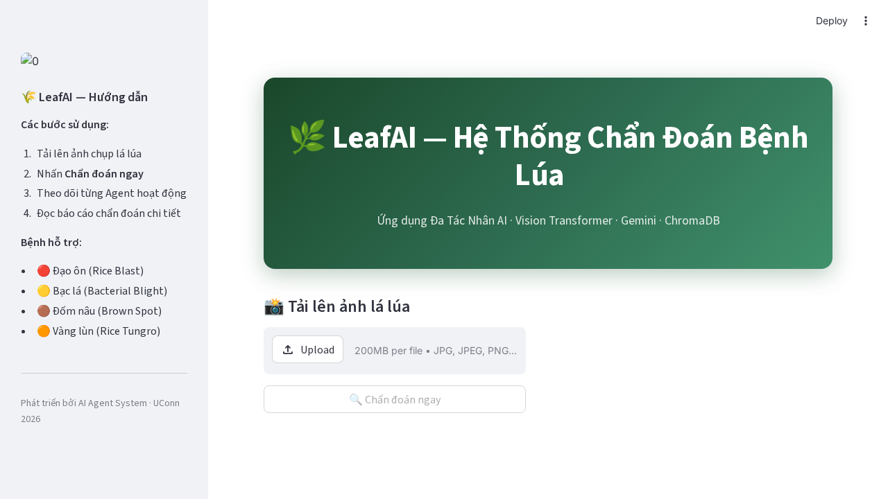

# 🌾 LeafAI: Comprehensive Project Report

## 1. Executive Summary
LeafAI is an advanced multi-agent Artificial Intelligence framework designed for precise agricultural diagnostics. Specifically, it focuses on analyzing images of rice leaves to detect and identify various diseases (e.g. Rice Blast, Bacterial Blight, Brown Spot, Tungro). Utilizing a composition of models including a Vision Transformer (ViT) and Google's Gemini LLM, plus Retrieval-Augmented Generation (RAG) capabilities via ChromaDB, it presents a cohesive pipeline that mimics expert agricultural consultation. 

*Figure 1: The LeafAI Streamlit-based web interface.*

---

## 2. System Architecture

The overarching system relies on a modular, multi-agent pattern coordinated by `CoordinatorAgent`. The application flow guarantees image sanitation, accurate classification, visual cross-referencing, and robust reporting. 

*Figure 2: Data Flow across the LeafAI System*

### 🤖 Multi-Agent Framework
1. **Preprocessing Agent (`rembg` & `PIL`)**
   - Automatically sanitizes the user's uploaded image. It trims away noisy backgrounds (like soil, human hands, and weeds) focusing exclusively on the leaf morphology, subsequently resizing to `224x224` and enhancing the visual contrast. 

2. **Classification Agent (`Hugging Face ViT`)**
   - Leverages the robust `prithivMLmods/Rice-Leaf-Disease` Vision Transformer. This engine acts as the primary diagnosis tool, extracting visual embeddings and producing a confidence-scored disease prediction. 

3. **Morphology Agent (`Gemini 2.5 Flash Vision`)**
   - Processes the same sanitized image contextually alongside the inferred prediction to derive a morphological description of the leaf spots and textures. This adds explainability by manually verifying *why* the ViT predicted what it did. 

4. **Retrieval Agent (`ChromaDB RAG`)**
   - Engages an offline vector database populated with domain-specific agricultural treatments and disease origin rules. Powered by Google's `gemini-embedding-001`, this agent retrieves scientific guidelines on dealing with diseases (e.g. bacterial factors, humidity warnings, bio-chemical controls).

5. **Coordinator Agent**
   - Oversees parallel execution routines, fetches the segmented data pipelines, and formats everything via `gemini-2.5-flash` to yield a fluid, native Vietnamese agricultural report.

---

## 3. Technology Stack

### Backend & Core
- **FastAPI**: Handles high-performance HTTP request handling, asynchronous file parsing, and provides interactive OpenAPI documentation available via `/docs`.
- **Python-Multipart & Uvicorn**: Underlying ASGI engine components added for robust raw image `.JPG`/`.PNG` chunked-upload capabilities. 

### AI & Machine Learning Infrastructure
- **LangChain**: Chains the LLM and RAG logic efficiently. 
- **ChromaDB**: Acts as the standalone vector-database storage, retaining generated document structures under `./data/processed/chroma_db/`.
- **Google Generative AI**: Supports both the `gemini-2.5-flash` orchestrator model and embeddings. 
- **PyTorch & Transformers**: Supports ViT loading logic locally via Hugging Face.

### Frontend
- **Streamlit**: Presents an interactive diagnostic dashboard. The interface tracks agent stages sequentially updating the UI (using a `progress_callback` strategy out of the `run_diagnosis()` workflow bridge).

---
